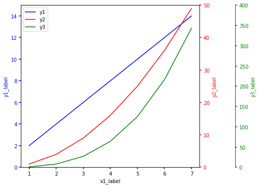

# y축을 여러개 사용하는 방법
- `twinx`, `twiny`


```python
import matplotlib.pyplot as plt

x1 = [1, 2, 3, 4, 5, 6, 7]
x2 = [3, 4, 5, 6, 7, 8, 9]

y1 = [2*i for i in x1]
y2 = [i*i for i in x1]
y3 = [i**3 for i in x1]
print(x1, x2, y1, y2, y3)
```

    [1, 2, 3, 4, 5, 6, 7] [3, 4, 5, 6, 7, 8, 9] [2, 4, 6, 8, 10, 12, 14] [1, 4, 9, 16, 25, 36, 49] [1, 8, 27, 64, 125, 216, 343]
    


```python
fig, ax = plt.subplots(figsize = (8,6))
fig.subplots_adjust(right=0.75)

twin1 = ax.twinx()
twin2 = ax.twinx()

# Offset the right spine of twin2.  The ticks and label have already been
# placed on the right by twinx above.
twin2.spines.right.set_position(("axes", 1.2))

p1, = ax.plot(x1, y1, "b-", label="y1")
p2, = twin1.plot(x1, y2, "r-", label="y2")
p3, = twin2.plot(x1, y3, "g-", label="y3")

ax.set_xlim()
ax.set_ylim(0, 15)
twin1.set_ylim(0, 50)
twin2.set_ylim(0, 400)

ax.set_xlabel("x1_label")
ax.set_ylabel("y1_label")
twin1.set_ylabel("y2_label")
twin2.set_ylabel("y3_label")

ax.yaxis.label.set_color(p1.get_color())
twin1.yaxis.label.set_color(p2.get_color())
twin2.yaxis.label.set_color(p3.get_color())

tkw = dict(size=4, width=1.5)
ax.tick_params(axis='y', colors=p1.get_color(), **tkw)
twin1.tick_params(axis='y', colors=p2.get_color(), **tkw)
twin2.tick_params(axis='y', colors=p3.get_color(), **tkw)
ax.tick_params(axis='x', **tkw)

ax.legend(handles=[p1, p2, p3], loc = 'upper left')

plt.show()
```


    

    


```python

```
